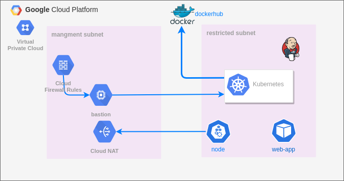

# Provision GKE cluster on GCP 
- Deploy jenkins as pod on GKE cluster
- Create a jenkins ci/cd pipeline to deploy a nodejs app on GKE cluster



### Provision infrastructure on GCP 🚀
1. Create a GCP project
2. ToDo : Create GS bucket and enable versioning to store the terraform state file
3. Clone repo 
4. edit project_id in terraform.tfvars with your project id and edit provider configuration 

#### Finally  Run the following command to provision the infrastructure 🚀
```bash
# initialize terraform
terraform init
# check plan
terraform plan 
# apply the plan it will take some time to complete 😴
terraform apply --auto-approve
```

#### Use the output command for authentication 🔐 with the cluster and open connection through the proxy


```bash
$ gcloud container clusters get-credentials gke-cluster --zone us-central1-a --project anwer-gcp ; gcloud compute ssh bastion-vm --project anwer-gcp  --zone us-central1-a -- -4 -L8888:localhost:8888 -N -q -f && export HTTPS_PROXY=localhost:8888
```

### Deploy Jenkins using kubectl 🚀

#### Commands 💻
```bash
kubectl apply -f ./jenkins/namespace.yaml
kubectl apply -Rf ./jenkins
```

----
### configure jenkins to access the cluster 

#### Copy kube config file to Jenkins pod
```sh
$ kubectl get po -n jenkins-ns 

NAME                             READY   STATUS    RESTARTS   AGE
jenkins-server-65b987d59-gm9k4   1/1     Running   0          2m34s

$ kubectl exec -n jenkins-ns -it jenkins-server-65b987d59-gm9k4 -- /bin/bash

#  inside pod
$ mkdir /var/jenkins_home/.kube
$ exit
# copy config file to jenkins pod

DevOps:$  kubectl cp -n jenkins-ns  ~/.kube/config jenkins-server-65b987d59-gm9k4:/var/jenkins_home/.kube/config

```


### Open jenkins in browser
goto MangeJenkins => Manage nodes and cloud => configure clouds => kubernetes

#### describe jnlp service to get the endpoint

```
$ kubectl describe service jenkins-jnlp -n jenkins-ns
Endpoints:         10.48.0.24:50000
```


### Create a pipeline to build [ nodejs_app ](https://github.com/mohamedanwer006/simple-nodejs-app.git) on GKE cluster

---

### Create ci/cd pipeline on jenkins to deploy the application 🚀

Use a declarative pipeline to deploy the application on GKE cluster

Link to [**pipeline script**](https://github.com/mohamedanwer006/simple-nodejs-app/blob/main/Jenkinsfile)

-----

### Clean up 💣

```bash
terraform destroy --auto-approve
```
---
### ToDo:
- Deploy jenkins using ansible
- limit access to service account


---
This [**Article**](https://blog.thecloudside.com/docker-in-docker-with-jenkins-pod-on-kubernetes-f2b9877936f2) 
and kubernetes plugins [**Documentation**](https://plugins.jenkins.io/kubernetes//)
I used to configure Docker with jenkins and dynamic agent 